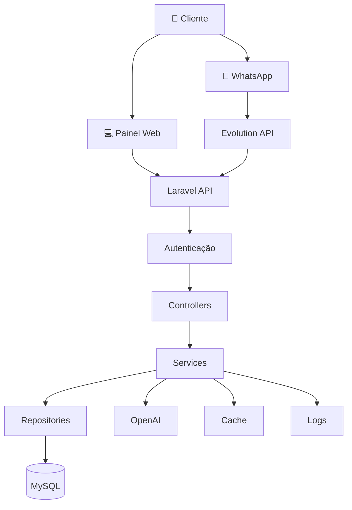

# Arquitetura Geral

```mermaid
flowchart TD

A[👤 Cliente]

A --> B[📱 WhatsApp]
A --> C[💻 Painel Web]

B --> D[Evolution API]

C --> E[Laravel API]

D --> E

E --> F[Autenticação]

F --> G[Controllers]

G --> H[Services]

H --> I[Repositories]

I --> J[(MySQL)]

H --> K[OpenAI]

H --> L[Cache]

H --> M[Logs]
```
